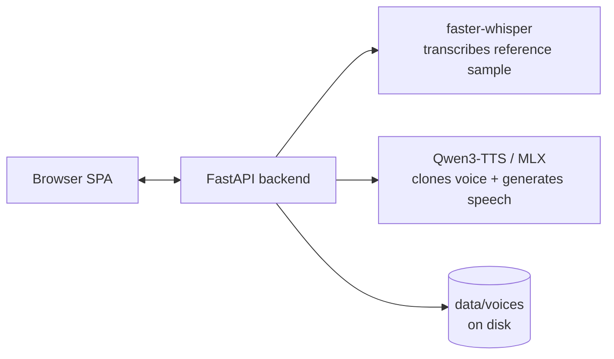

# 🎙️ VoiceForge

A polished, mobile-friendly web app for cloning voices and generating speech — running **100% locally** on your Mac. No cloud, no API keys; your voice never leaves your machine.

**[Live demo →](https://voiceforge-4n9.pages.dev)**

▶️ **[Watch it generate speech live on a MacBook (28 s, with sound)](static/media/voiceforge-demo.mp4)**
<!-- To embed an inline player: drag static/media/voiceforge-demo.mp4 into GitHub's README editor and replace the line above with the user-attachments URL it produces. -->

## What it does

- Clone a voice from a short recording (or uploaded audio file)
- Generate speech in that voice from any text, with adjustable variability and speaking speed
- Dictate text locally instead of typing, transcribed on-device
- Save, replay, download, and manage clips per voice
- Works from an iPhone over the LAN via HTTPS, mic access included

## How it works



1. You record (or upload) a reference sample; **faster-whisper** transcribes it locally — Qwen3-TTS's cloning needs that reference transcript alongside the audio.
2. You type (or dictate) text; **Qwen3-TTS**, running natively on Apple Silicon via **MLX**, generates speech in the cloned voice.
3. Everything — samples, transcripts, config, generated clips — is stored as plain files under `data/voices/`.

## Tech stack

- **TTS / voice cloning:** [Qwen3-TTS](https://github.com/QwenLM/Qwen3-TTS) 1.7B Base running natively on Apple Silicon via [mlx-audio](https://github.com/Blaizzy/mlx-audio)
- **Speech-to-text dictation:** faster-whisper (base model, CPU)
- **Backend:** FastAPI · **Frontend:** vanilla JS single-page app

## About the live demo

The hosted copy at the link above is a **pre-recorded demo**: every clip was generated locally ahead of time, from voices recorded with the speakers' consent, and simply played back — nothing is generated live, and there's no backend attached. Voice cloning and speech generation only ever run on your own Mac; there's deliberately no hosted backend (it would mean real compute cost and an open door for misuse of other people's voices). To try actual cloning, run it locally — see below.

## Run it locally

Requirements:
- An Apple Silicon Mac running macOS (MLX needs Metal — this won't run on Intel Macs or other platforms)
- ~4 GB free disk for model weights (downloaded on first run)
- `brew install uv sox ffmpeg`

```bash
git clone https://github.com/danieljfrazer-ops/VoiceForge.git
cd VoiceForge
./run.sh
```

The first run creates a Python virtual environment (via `uv`) and installs dependencies automatically; subsequent runs are instant.

Then open:

| Where | URL |
|---|---|
| Desktop Chrome | http://localhost:7860 |
| iPhone (same Wi-Fi) | https://YOUR-MAC-IP:7861 |

The exact iPhone URL (with your Mac's LAN IP) is printed in the terminal on startup.

### iPhone notes
- iOS requires **HTTPS** for microphone access, so use the `https://…:7861` address.
- The certificate is self-signed: Safari will warn — tap **Show Details → visit this website**. One-time only.
- Add to Home Screen for a full-screen app feel.

### First run

The Qwen3-TTS MLX weights (~3.4 GB) and Whisper base model download from Hugging Face on first load and are cached in `~/.cache/huggingface`. Subsequent starts are fast; the model loads in the background at startup.

### Why no Docker

MLX needs direct access to Apple's Metal API for GPU acceleration, which isn't available inside a Linux container — so this only runs as a native macOS process, not Dockerized.

## Make your own demo content

See [docs/DEMO_CONTENT.md](docs/DEMO_CONTENT.md) for a step-by-step guide to recording voices, generating sample clips, and exporting them for the hosted demo.

## Deploy the demo to Cloudflare Pages

**Option A — Git integration:**
Workers & Pages → Create → Pages → Connect to Git → select this repo. Framework preset: **None**. Build command: *(empty)*. Build output directory: **`static`**.

**Option B — CLI:**
```bash
npx wrangler pages deploy static --project-name voiceforge
```

If you use a different Cloudflare Pages project name, update the live demo link in this README to match.

## Responsible use

Only clone voices you have permission to clone (yours, or with the speaker's explicit consent). Voice samples are transcribed locally by Whisper (Qwen3-TTS cloning needs the reference transcript). Qwen3-TTS output is **not watermarked** — use it responsibly, and don't publish demo content you don't have consent to share.

## Project layout

```
backend/
  server.py     FastAPI app, routes, HTTPS bootstrap
  engine.py     Qwen3-TTS (MLX) + faster-whisper model wrappers
  storage.py    Filesystem-backed voice/clip storage
static/         Vanilla JS single-page app (served by the backend; also the Pages build output)
  demo/         Pre-generated demo content (empty until you export voices; commit it to publish)
  media/        Screen recording shown on the hosted demo
scripts/
  export_demo.py  Exports voices from data/voices/ into static/demo/
docs/
  DEMO_CONTENT.md  Guide to recording voices + building demo content
data/voices/    Reference samples, config and generated clips (gitignored)
```
